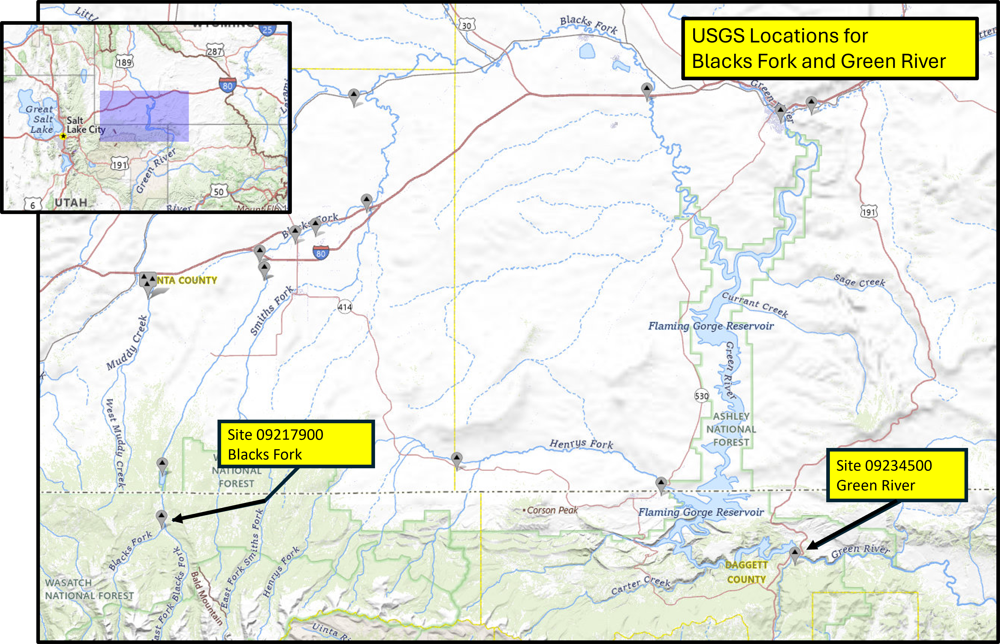
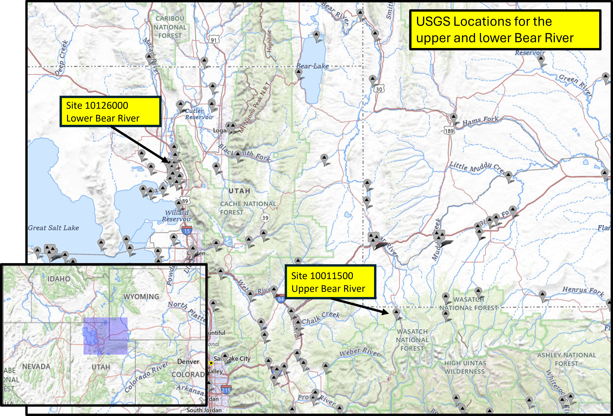

# HydroinformaticsHomework
Repo for Homework #1: Reproducible Time-Series Analysis, Temporal Scaling, and Visualization

This project looks at 4 locations in Utah with USGS Streamflow data. Two locations are in headwater catchments, and two are downstream and below reservoirs and/or other diversions. Streamflow is compared using visual analysis via time series plots.

## What's here
This repo includes a [data](data/) directory with all necessary data, a [notebooks](notebooks/) directory with 3 .ipynb scripts ([01](notebooks/01_data_aquisition_visualization.ipynb) - initial data reading, visualization, and subsetting; [02](notebooks/02_resampling_aggregation.ipynb) - data aggregation into weekly and monthly means; and [03](notebooks/03_comparative.ipynb) - comparative analysis of a wet year and a dry year), and a [media](media/) directory with all saved images/figures.   

## Site information
**Headwater catchments:**\
Site Number: 09217900\
Site Name: BLACKS FORK NEAR ROBERTSON, WY\
Site Type: Stream

Site Number: 10011500\
Site Name: BEAR RIVER NEAR UTAH-WYOMING STATE LINE\
Site Type: Stream

**Below reservoirs:**\
Site Number: 09234500\
Site Name: GREEN RIVER NEAR GREENDALE, UT (below Flaming Gorge)\
Site Type: Stream

Site Number: 10126000\
Site Name: BEAR RIVER NEAR CORINNE, UT (near GSL)\
Site Type: Stream

Data from: https://apps.usgs.gov/nwismapper/

## Site maps

